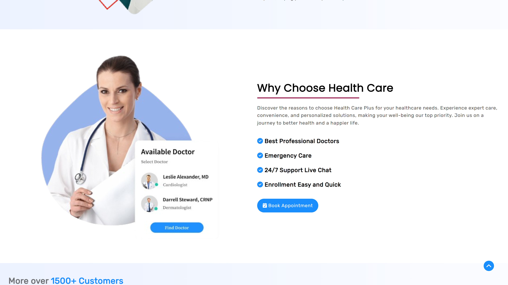

# health-care-plus

> HealthCare &amp; Medical Care website built with React

[Visit **Health Care Plus** website](https://health-care-plus.vercel.app/)

Welcome to the Health Care Plus project repo! This is a React-based website aimed at providing accessible and personalized healthcare services to users. The website allows users to connect with expert doctors, schedule appointments, and receive expert medical advice.

## Project Overview

- **Framework**: React.js
- **Deployment**: Vercel
- **Libraries**: React-Toastify, React Router DOM, FontAwesomeIcon

## Features

- Easily schedule appointments with the specialists.
- Engage in virtual consultations to receive expert medical advice.
- Responsive UI design for seamless user experience across devices.
- Utilizes React-Toastify for notifications, React Router DOM for page routing, and FontAwesomeIcon for icons.
- Deployed using GitHub Pages for easy access and sharing.

## Screenshots

## Getting Started

To run the project locally:

1. Clone this repository: `git clone https://github.com/devmaster518/health-care-plus`
2. Navigate to the project directory: `cd Health-Plus`
3. Install dependencies: `npm install`
4. Start the development server: `npm start`
5. Open your browser and visit: `http://localhost:3000/`

&copy; 2024 @devmaster518 All rights reserved.
